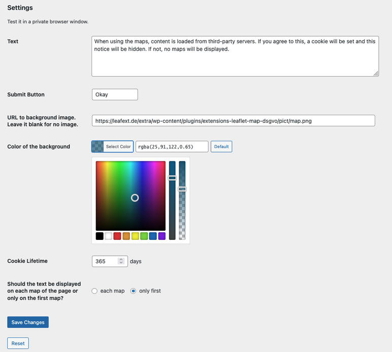
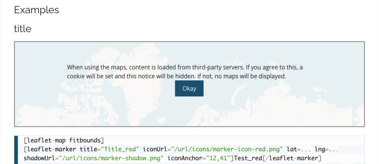

# DSGVO snippet for Leaflet Map and its Extensions Github

Contributors: hupe13  
Tags: dsgvo, gdpr, leaflet  
Tested up to: 6.7  
Stable tag: 250121
Requires at least: 6.0  
Requires PHP: 7.4  
License: GPLv2 or later  

Respect the DSGVO / GDPR when you use Leaflet Map and Extensions for Leaflet Map.

## Description

### GDPR

There is now an official [WordPress plugin](https://wordpress.org/plugins/dsgvo-leaflet-map/) and it is not necessary for you to use this from Github. Unless you have a suggestion for an improvement or a new function and I ask you to test it.

According to the GDPR, the user must actively agree if content is to be loaded from third-party servers.  
The WordPress plugins <a href="https://wordpress.org/plugins/leaflet-map/">Leaflet Map</a> and <a href="https://wordpress.org/plugins/extensions-leaflet-map/">Extensions for Leaflet Map</a> are loading content from the defined tile servers as well as unpkg.com.  
This plugin requests the user's permission to load the maps.  
You can customize the text and use it on your own responsibility.

The plugin supports <a href="https://wordpress.org/plugins/theme-translation-for-polylang/">Theme and plugin translation for Polylang (TTfP)</a>.

### DSGVO

Es gibt nun ein offizielles [WordPress Plugin](https://de.wordpress.org/plugins/dsgvo-leaflet-map/) und es ist nicht nötig, dass du dieses hier verwendest. Es sei denn, du hast einen Vorschlag für eine Verbesserung bzw. eine neue Funktion und ich bitte dich, diese zu testen.

Laut DSGVO muss der Nutzer aktiv zustimmen, wenn Inhalte von Drittservern geladen werden sollen.  
Die WordPress-Plugins [Leaflet Map](https://de.wordpress.org/plugins/leaflet-map/) und [Extensions for Leaflet Map](https://de.wordpress.org/plugins/extensions-leaflet-map/) laden Inhalte von den definierten Kachelservern sowie unpkg.com.  
Dieses kleine Snippet holt die Zustimmung des Nutzers zum Laden der Karten ein.  
Du kannst den Text anpassen und es auf eigene Verantwortung verwenden.  

Das Plugin unterstützt <a href="https://wordpress.org/plugins/theme-translation-for-polylang/">Theme and plugin translation for Polylang (TTfP)</a>.

## Screenshots

1. Settings  
2. Frontend  

## Installation

* Install and configure the plugin <a href="https://wordpress.org/plugins/leaflet-map/">Leaflet Map</a>.
* Install and configure the plugin <a href="https://wordpress.org/plugins/extensions-leaflet-map/">Extensions for Leaflet Map</a>.
* Then install this plugin: Download the <a href="https://github.com/hupe13/extensions-leaflet-map-dsgvo/archive/refs/heads/main.zip">ZIP file</a> and install it on the plugin page of your WordPress installation.
* Go to Settings - Leaflet Map - Leaflet Map GDPR and get documentation and settings options.

You will get updates with the [Plugin Update Checker](https://github.com/YahnisElsts/plugin-update-checker).
Maybe you need a Github token.

## Frequently Asked Questions

**Is that enough to comply with the GDPR?**

* I don't know, ask a law expert.

## Changelog

###  250122

* interpreting frontend / backend (Elementor)
* new shortcode leafext-cookie

### Previous

[Changelog](https://github.com/hupe13/extensions-leaflet-map-dsgvo/blob/main/changes.md)
